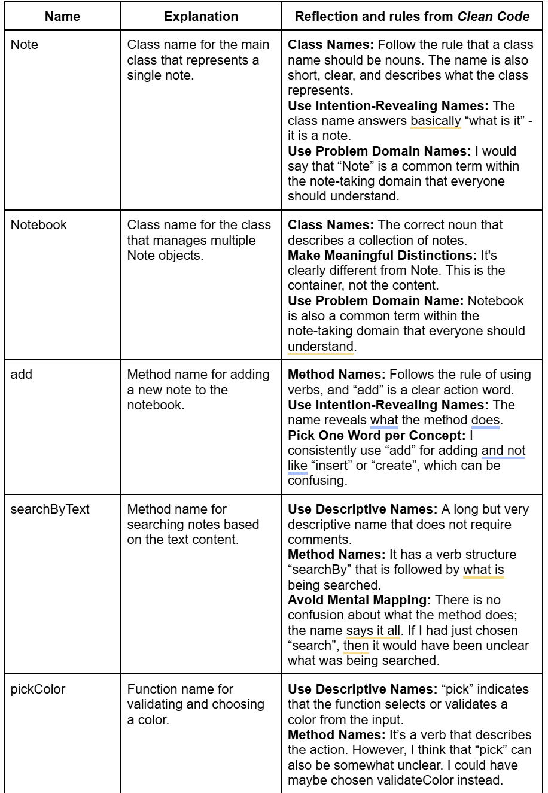
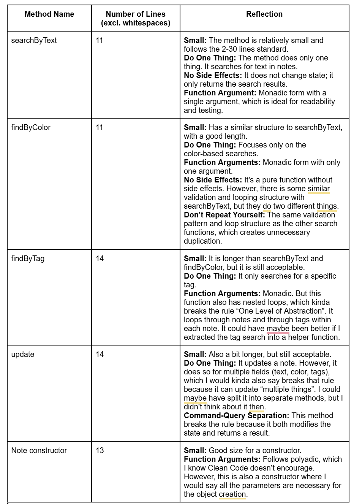

# Reflection - Clean Code - Chapter 2 and 3

## Naming - Chapter 2
## A table of names from the public interface

## Reflection on Chapter 2
I would say that Chapter 2 has made me more aware of how crucial naming is for the code quality. In the other courses that we previously had, I focused more on making the code work than making it more readable. Now I understand that naming is like a communication between programmers.

In my Note module, I notice that I already followed some rules without thinking about it, especially *Use Intention-Revealing Names* and *Class Names as Nouns*. However, I also see some room for improvement, especially with the pickColor function. For some people, maybe the name suggest that the function chooses between multiple colors, while in reality it validates a color and provides a default. A better name would maybe have been validateColor, as I said in the naming table above.

I also appreciate/like the rule *Don’t Be Cute* because I think it’s easy to get creative with names. But for me, clarity is more important than being creative, and I think I have straightforward names in my code like *Note*, *Notebook*, *add*, and so on.

## Functions - Chapter 3
## A table of the longest methods/functions

## Reflection on Chapter 3
I would say that Chapter 3 on functions has been very insightful. The *Do One Thing* principle turned out to be harder to implement than I expected. I think my *update* method is a clear example of that. It updates three different fields, which technically means it does three things. Now that I am writing this reflection, I think it would have been better to have separate methods for each type of update.

I am happy that my functions are generally small and that I have been trying to avoid deep nesting. However, I noticed some code duplication between *searchByText*, *findByColor*, and *findByTag*. They all share similar validation logic and looping structure, and this goes against the *Don’t Repeat Yourself* principle.

Finally, *Command Query Separation* was also something that I never thought about before. My *update* method both modifies the state and returns the updated note. I better way would maybe have been to separate these, so update only modifies and another method could have been used to fetch the results.

## Reflection on my own code quality

