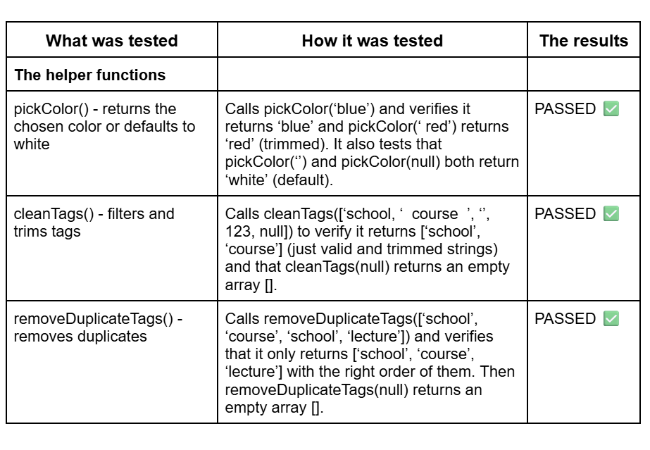
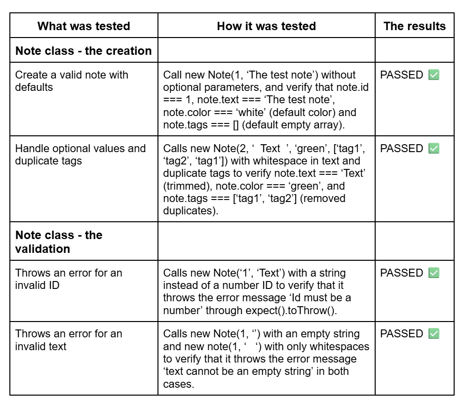
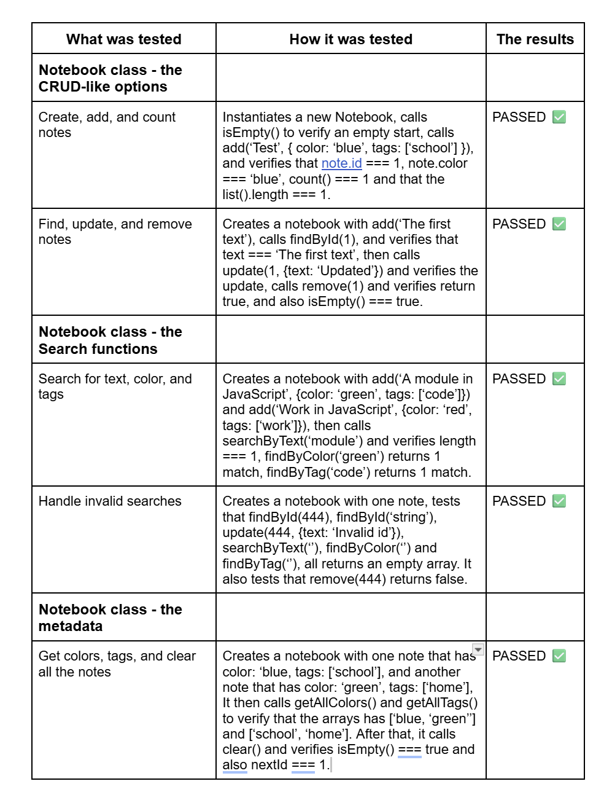
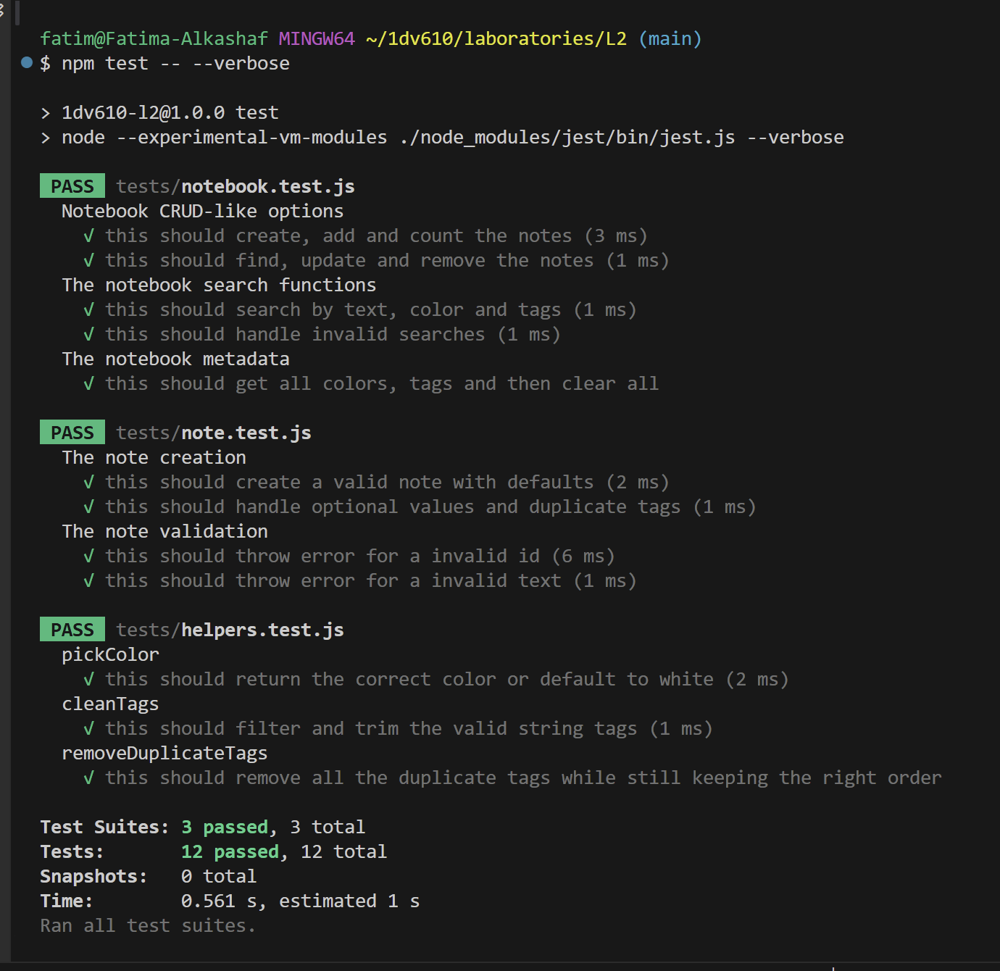

# Test Report - Note Module

## Test Method
The module has been tested with automated unit tests using the test framework Jest.
The tests are run with the command **npm test** and covers all public methods and functions in the module, as well as error handling.
All the tests are placed in a folder called **tests** and are divided into three different files: **helpers.test.js**, **note.test.js** and **notebook.test.js**.

### Test Results

### Summary
All 12 tests passed successfully and works as expected.
The tests covers both normal use cases and edge cases for error handling.
All public methods and functions have been verified to work correctly with different types of inputs.
The module is overall ready for use

**Test Statistics**
- **Total number of tests:** 12
- **Passed tests:** 12
- **Failed tests:** 0
- **Test files:** helpers.test.js, note.test.js and notebook.test.js

